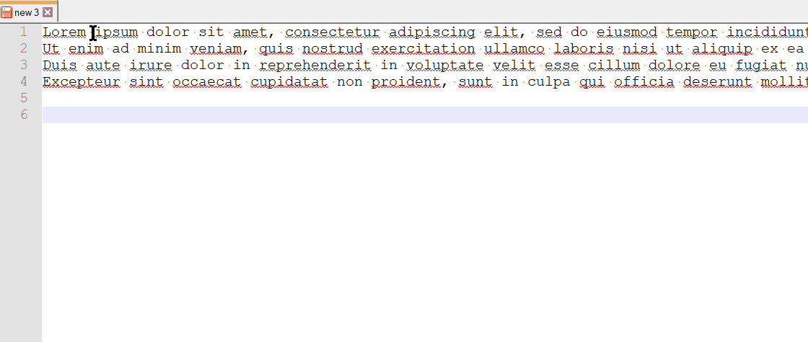

#  Automatic entry of clipboard contents

Have you ever been frustrated by not being able to 'paste' into a particular text input because of a lock or a bug?
I did !

So I wrote this little PowerShell script. It simulates the keyboard typing the text that is in the clipboard.
The script is called by a (keyboard) shortcut.
All I have to do to use it is :

- Copy the selected text
- Press Ctrl+Alt+V
- Select the destination window



```
Param(
  [int]$delay = 5
)
#[int]$delay = 5
 
$inputString = Get-Clipboard;
if($inputString -is "string")
{
    $previewString = $inputString
}
else
{
    $previewString = $inputString[0];
}
if($previewString.Length -gt 33)
{
    $previewString = $previewString.Substring(0,30) + " ...";
}
 
if($delay -gt 1)
{
    Write-Output "Typing ""$previewString"" starts in $delay seconds";
    #Start-Sleep -Seconds $delay
     
    while($delay -gt 0)
    {
        Start-Sleep -Seconds 1;
        $delay -= 1;
        Write-Output "$delay ...";
    }
}
 
$inputString = Get-Clipboard;
$Milliseconds = 0;
foreach ($line in $inputString)
{
    foreach ($char in [char[]]$line)
    {
        if ($char -match "[\+\^\%\~\(\)\{\}\[\]]")
        {
            [string]$char = "{$char}";
 
        } # if ($char -match "...
 
        [System.Windows.Forms.SendKeys]::SendWait($char);
        if($Milliseconds -gt 0)
        {
            Start-Sleep -Milliseconds $Milliseconds;
        }
        $i += 1;
                 
    } # foreach ($char in [char[]]$line)
             
    [System.Windows.Forms.SendKeys]::SendWait("{ENTER}");
    $i += 1;
 
} # foreach ($line in $inputString)$inputString = Get-Clipboard
#thx: https://blogs.msdn.microsoft.com/timid/2014/08/05/send-keys/
```

ps: I copied most of the 'SendKeys' part from [here](https://blogs.msdn.microsoft.com/timid/2014/08/05/send-keys/).