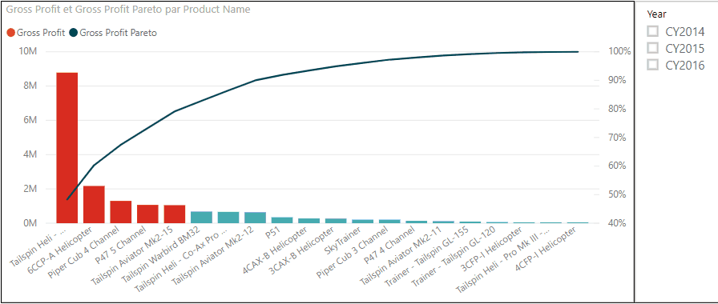
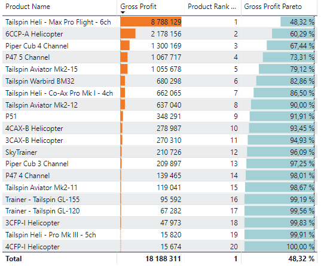
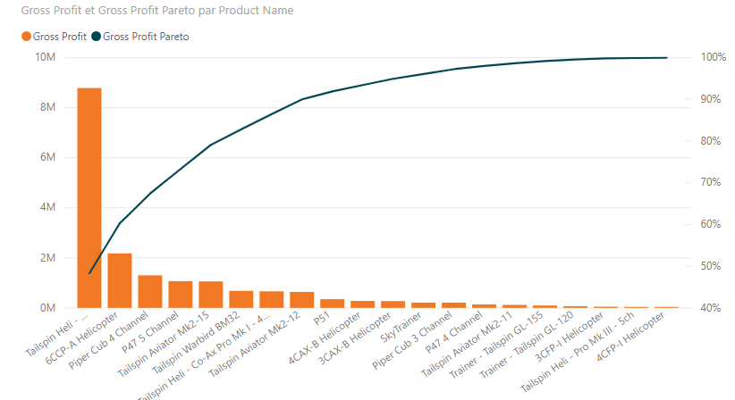

# Creer un Pareto avec Power BI

_« Le principe de Pareto, aussi appelé loi de Pareto, principe des 80-20 ou encore loi des 80-20, est un phénomène empirique constaté dans certains domaines : environ 80 % des effets sont le produit de 20 % des causes. Il a été appliqué à des domaines comme le contrôle qualité. On considère souvent que les phénomènes pour lesquels ce principe est vérifié suivent une forme particulière de distribution de Pareto. »_ https://fr.wikipedia.org/wiki/Principe_de_Pareto

Représenté de manière graphique ça ressemble à ça :



Le diagramme de Pareto, permet donc du visualiser rapidement quand les causes ont produit une certaine quantité d’effet.

Nativement il n’y a pas de visuel _Pareto_ dans Power BI. Mais puisqu’il s’agit simplement d’un histogramme et d’une courbe combinés, nous allons pouvoir nous débrouiller avec le visuel _Graphiques en courbes et histogramme empilé_.


Pour faire mon Pareto je vais utiliser un jeu de données d'exemple appelé « US Sales ».

La méthode est la suivante :

1. Faire une mesure de classement par rapport à la colonne à trier
2. Faire une mesure avec les valeurs cumulées
3. Faire un ratio des valeurs cumulées par rapport au total.



1. Je veux faire mon Pareto une mesure appelée _Gross Profit_, par rapport à la colonne _ProductName_ contenue dans ma table de faits _Sales_. Je détermine d'abords le rang de chaque valeur de cette colonne avec **RANKX()** :

```
Product Rank by Gross Profit = 
RANKX(
  DISTINCT(ALLSELECTED(Sales[Product Name]))
  , [Gross Profit]
)
```

2. Je peux à présent recalculer _Gross Profit_ en cumulant les cumulant les valeurs en fonction du rang :

- Rang = 1 : valeur du rang 1
- Rang = 2 : valeurs du rang 1 et du rang 2
- Rang = 3 : valeurs du rang 1, du rang 2 et du rang 3
- ...

```
Gross Profit Pareto = 
VAR currentRank = [Product Rank by Gross Profit]
RETURN 
CALCULATE([Gross Profit]
  , FILTER(ALLSELECTED(Sales[Product Name]), [Product Rank by Gross Profit] <= currentRank)
)
```

3. Je peux ensuite ajouter la pondération par rapport au total pour avoir un pourcentage :

```
Gross Profit Pareto = 
VAR total = CALCULATE([Gross Profit], ALLSELECTED(Sales[Product Name]))
VAR currentRank = [Product Rank by Gross Profit]
RETURN 
DIVIDE(
  CALCULATE([Gross Profit]
    , FILTER(ALLSELECTED(Sales[Product Name]), [Product Rank by Gross Profit] <= currentRank)
  )
  , total
)
```

