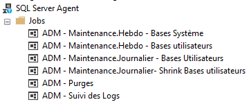

# Lister et désactiver les jobs SQL Agent



Un SQL Agent avec une centaine de jobs ça fait beaucoup de clics quand on veut tout désactiver ... Mais heureusement, il y a un script pour ça !

```
select s.name as job_name
--, s.job_id 
, s.enabled
, l.name AS job_owner
, 'EXEC dbo.sp_update_job @job_name = N''' + s.name + ''', @enabled = 0' as switch_to_enabled
, 'EXEC dbo.sp_update_job @job_name = N''' + s.name + ''', @enabled = 0' as switch_to_disabled
, 'EXEC dbo.sp_update_job @job_name = N''' + s.name + ''', @enabled = ' + convert(nvarchar(255),  s.enabled) as switch_to_this_state
from msdb..sysjobs s
left join master.sys.syslogins l ON l.sid = s.owner_sid
where s.[name] like '%'
order by s.name
 
return
 
USE msdb ;
--coller les requêtes ici
```