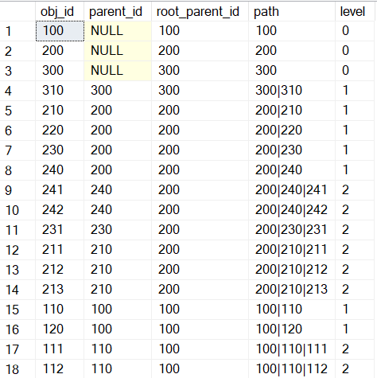

# Un exemple de requête SQL récursive

<p style="text-align: right;">2022-12-15</p>

Les récursives c'est à mon avis le _summum_ du rafinement de la requête SQL ! Simple à lire, rapide à expliquer, compliqué à comprendre ... Personnelement j'adore !


Mais pour que ce soit clair pour tout le monde, il vaut mieux avoir un exemple sous le bras. Alors c'est parti pour l'exemple !

---

J'ai une liste d'objets avec l'identifiant du parent direct.

obj_id|parent_id
---|---
100|
110|100
111|110
112|110
120|100

```
└───100
    ├───110
    │   ├───111
    │   └───112
    └───120
```

```SQL
drop table if exists #t;
create table #t (obj_id int, parent_id int)
insert into #t 
values (100, null),(200, null),(300, null)
,(110, 100),(120, 100)
,(210, 200),(220, 200),(230, 200),(240, 200)
,(310, 300)
,(111, 110),(112, 110)
,(211, 210),(212, 210),(213, 210),(231, 230),(241, 240),(242, 240)
;
```

Je veux récupérer pour chaque objet :
- la **racine** : c'est à dire le parent le plus haut (qui n'a lui-même pas de parent).
- le **chemin** : la liste de tous les objets du parent "racine" jusqu'à l'objet ; sous la forme ```100|110|112```.
- le **niveau** : le nombre de parents de l'objet.

La requête récursive contient deux élements :
- un **membre d'ancrage** : la liste des élements que je peut obtenir sans récursion. Ici il s'agit des racines qui n'ont pas de parent : ```select *, 0 as [niveau] from #t where parent_id is null```
- un **membre récursif** : qui va réutiliser la requête en cours de définition (d'où le _récursif_, vous l'avez ?) : ```[niveau] + 1 as [niveau]```

Je laisse la requête d'exemple ci-dessous, et pour le reste il y a la [documentation](https://learn.microsoft.com/fr-fr/sql/t-sql/queries/with-common-table-expression-transact-sql?view=sql-server-ver16#guidelines-for-defining-and-using-recursive-common-table-expressions) : 

```SQL
with cte as (
	select t.obj_id
		, t.parent_id
		, t.obj_id as root_parent_id
		, convert(varchar(255), t.obj_id) as [path]
		, 0 as [level]
	from #t t
	where parent_id is null
union all 
	select t.obj_id
		, t.parent_id
		, c.root_parent_id
		, convert(varchar(255), concat(c.[path], '|', convert(varchar(255), t.obj_id))) as [path]
		, c.[level] + 1 as [level]
	from #t t
	inner join cte c on c.obj_id = t.parent_id
)

select * from cte
```


