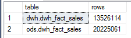

# Connaître le nombre de lignes dans chaque table

Pour connaître le nombre de lignes dans une table d'une base SQL Server, il n'est pas forcément nécessaire de faire un ```select COUNT(*)```. 

Le nombre de lignes dans chaque partition est contenu dans la table système _partitions_.

```sql
select s.name + '.' + t.name as [table]
, sum(p.rows) as [rows]
, COUNT(1) as [partitions]
from sys.partitions p
inner join sys.tables t on t.object_id = p.object_id
inner join sys.schemas s on s.schema_id = t.schema_id
where p.index_id in (0, 1)
and t.name like '%'
group by s.name, t.name
```



Et pour avoir le détail par partition :

```sql
select s.name + '.' + t.name as [table]
, p.partition_number
, max(prv.value) as [boundary]
, sum(p.rows) as [rows]
from sys.partitions p
inner join sys.tables t on t.object_id = p.object_id
inner join sys.schemas s on s.schema_id = t.schema_id
inner join sys.indexes as i on i.object_id = t.object_id and i.index_id = p.index_id
left join sys.partition_schemes ps on ps.data_space_id = i.data_space_id
left join sys.partition_functions pf on pf.function_id = ps.function_id
left join sys.partition_range_values prv on prv.function_id = pf.function_id and prv.boundary_id = p.partition_number
where p.index_id in (0, 1)
and t.name like '%'
group by s.name
, t.name
, p.partition_number
```